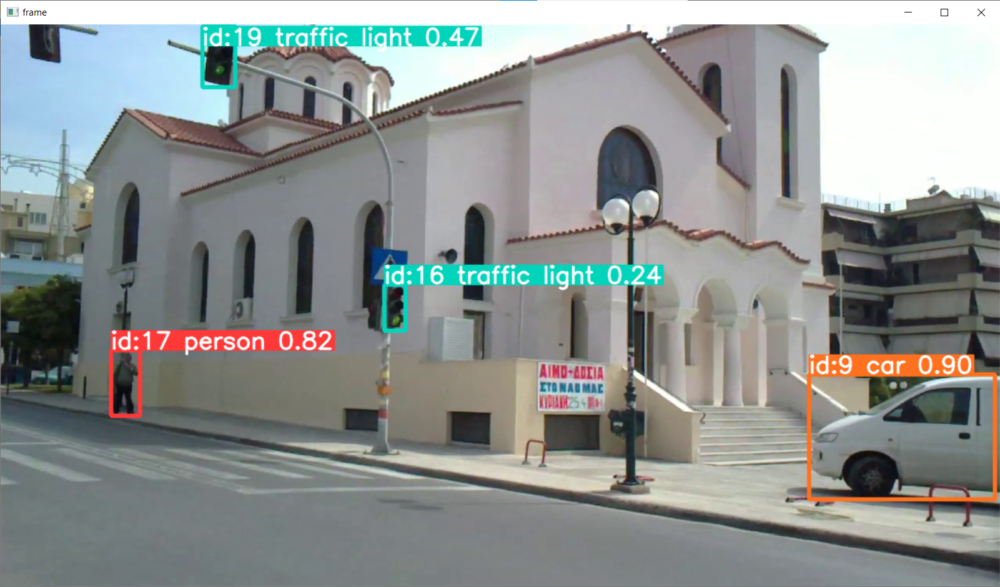
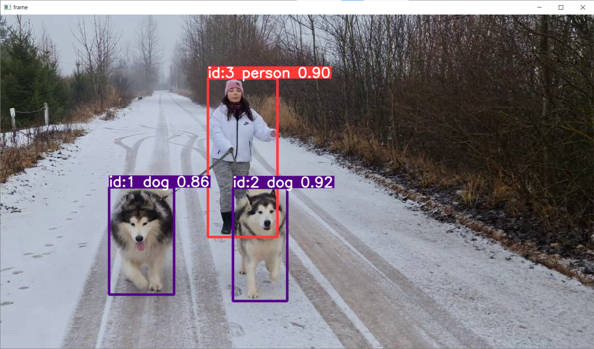

# object-detection-and-tracking-yolo8
Object detection and tracking using Python and yolo8

# how to create a prject:
$ pip install ultralytics

# how to run
$ python main.py

# examples:

# note:
after first run of the script, ./yolov8n.pt file of a model will be downloaded

# links to the test videos:
https://www.youtube.com/watch?v=WAN5T2S0i2I&ab_channel=Techblog.gr

https://drive.google.com/file/d/1TM3KF_JC_j9znTjtsGxF8InmUbPPPOUE/view?usp=sharing